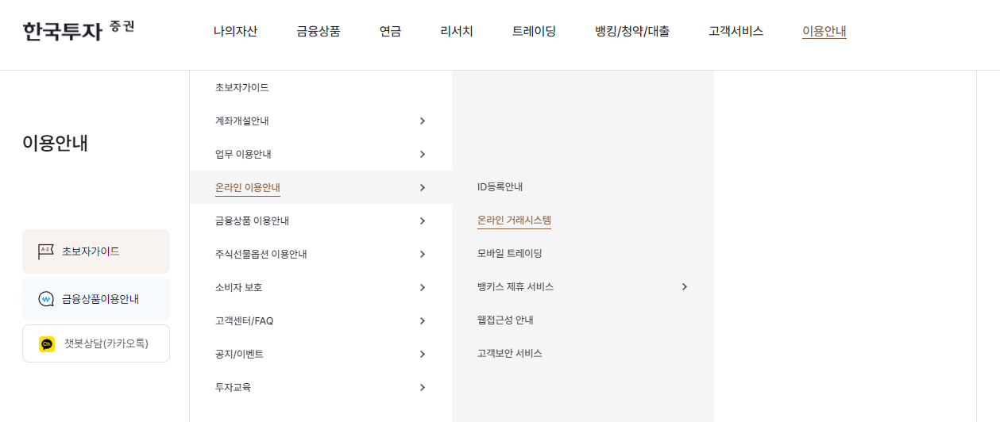
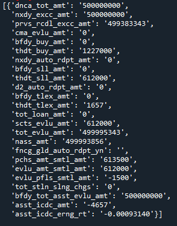
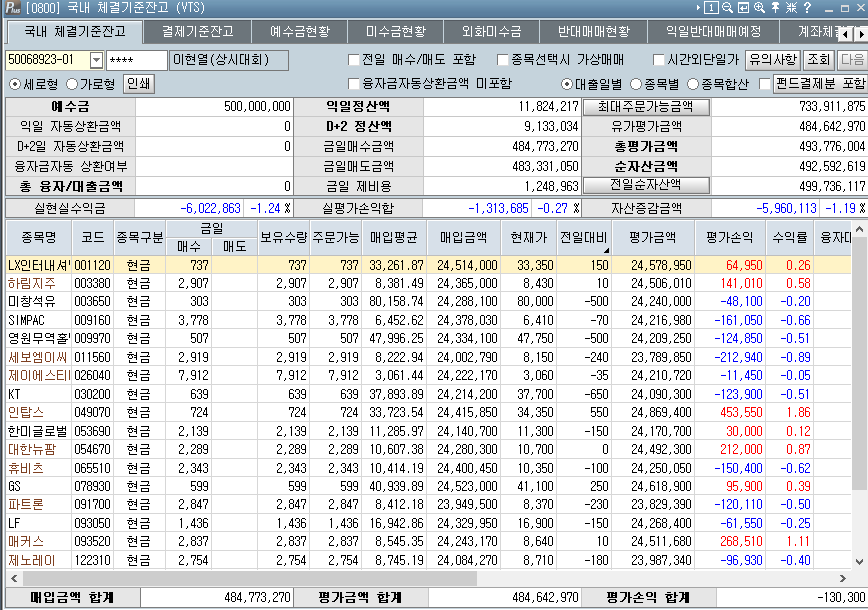

# API

원하는 조건에 따라 주식을 사거나 파는 등 자동거래를 하기 위해서는 API가 필수적이다. 조건에 따라 매번 손으로 매매하는 것은 번거로울 뿐만 아니라 불가능에 가까우므로, API가 없이는 매매 자동화가 불가능하다.

기존에도 국내 증권사들(키움증권, 대신증권, 이베스트증권 등)이 API를 제공해주기는 하였다. 그러나 이는 HTS에 로그인을 한 후 COM 방식을 연결해야 하는 매우 불편한 방식이었다.

링크: [키움증권 API 예제](https://eco.jnomy.com/2022/04/open-api-with-python.html)

반면 2022년 한국투자증권에서 **Rest API**와 **웹소켓 방식**을 제공함에 따라 HTS에 로그인을 하지 않고 API Key만을 이용한 트레이딩이 가능해졌다. 또한 국내 뿐만 아니라 해외주식에 대한 조회/주문 기능도 제공하고 있다. 바야흐로 진정한 자동거래가 가능해진 셈이다.

| 항목                | 오픈 API            | 기존 API      |
|---------------------|---------------------|---------------|
| 사용 가능 환경 (OS) | 제한 없음           | 윈도우만 가능 |
| 구동 방식           | Rest API, websocket | Com, ocx, dll |
| 인증 방식           | 대체 인증 토큰      | HTS 접속 인증 |

오픈 API는 모의투자 계좌와 실제 계좌에서 사용할 수 있으므로, 모의투자 계좌를 대상으로 충분히 테스트를 거친 후 실졔 계좌에 적용하는 것이 안전하다. 또한 API 사용법은 KIS Developers 홈페이지에 자세히 나와있으니 참조하기 바란다.

    https://apiportal.koreainvestment.com/

API를 신청하기 위해서는 계좌가 있어야 한다. 한국투자증권 계좌는 앱을 통해 비대면으로도 개설이 가능하다. 또한 API 서비스가 제대로 작동하고 있는지 HTS를 통해 확인해볼 필요가 있으므로, 이 역시 미리 다운로드 받는다. 먼저 한국투자증권 홈페이지에 접속하여 $$이용안내 → 온라인 이용안내 → 온라인 거래시스템$$를 선택한다.



여러 PC 전용 프로그램(HTS) 중 가장 일반적인 'eFriend Plus'를 다운로드 받는다.


# 모의투자 및 API 서비스 신청하기

모의투자 계좌에서 API 서비스를 테스트해보기 위해 모의계좌를 신청한다. 한국투자증권 홈페이지에 접속하여 로그인을 한 후 $$트레이딩 → 모의투자 → 주식/선물옵션 모의투자 → 모의투자안내$$를 선택하여 계좌를 개설한다.


$$신청/재도전$$ 탭을 클릭한 후 리그구분에서 국내주식, 금액은 최대인 5억원을 선택한다. 그 후 이메일 및 휴대폰 번호를 입력하고 하단의 $$신청$$을 클릭한다.


신청을 완료하면 다음과 같은 화면이 뜬다. 모의계좌번호는 API 신청시 필요하므로 기억해두거나 적어두기 바란다.


이제 API 서비스를 신청하도록 한다. 한국투자증권 홈페이지에서 $$트레이딩 → Open API → KIS Developers → KIS Developers 서비스 신청하기$$를 선택한다.


먼저 휴대폰 번호 인증을 한다.


다음으로 유의사항확인 화면에서 동의를 누른 후 다음을 클릭한다.


신청정보 화면에서 $$종합계좌$$와 $$모의계좌$$ 모두 선택한다. 이후 $$다음$$ 버튼을 클릭하면 인증화면으로 넘어간다.


인증을 마치면 종합계좌와 모의계좌에 각각 APP Key와 APP Secret이 생성된다. 해당 key를 통해 계좌 내에서 매매가 가능하므로 유출되지 않도록 조심한다.


발급받은 API Key를 저장한다.

-   R: **.Renviron** 파일에 추가

-   Python: keyring 패키지를 이용

HTS에서 $$eFriend 모의투자$$ 탭을 선택해 모의투자 계좌에 로그인하면, 잔고에 신청한 금액인 5억이 있는것을 확인할 수 있다.


# 접근토큰 및 해쉬키 발급받기

API를 이용해 조회 및 주문을 하기 위해서는 접근토큰과 해쉬키가 추가적으로 필요하다.

## 접근토큰 발급받기

앞서 발급받은 App Key와 App Secret을 이용해 접근토큰을 받을 수 있으며, 접근토큰을 통해 계좌에 접근할 수 있다. 접근토큰을 발급받는 법은 KIS Developers의 'API 문서' 페이지에 상세히 나와있다.

-   KIS Developers: <https://apiportal.koreainvestment.com/intro>


기본정보 및 LAYOUT의 항목에 맞춰 코드를 작성해보도록 하자.

-   파이썬

```{python eval = FALSE}
import requests
import json
import keyring

# key
app_key = keyring.get_password('mock_app_key', 'Henry')
app_secret = keyring.get_password('mock_app_secret', 'Henry')

# base url
url_base = "https://openapivts.koreainvestment.com:29443" # 모의투자

# information
headers = {"content-type": "application/json"}
path = "oauth2/tokenP"
body = {
    "grant_type": "client_credentials",
    "appkey": app_key,
    "appsecret": app_secret
}

url = f"{url_base}/{path}"
res = requests.post(url, headers=headers, data=json.dumps(body))
access_token = res.json()['access_token']
```

-   R

```{R eval = FALSE}
library(httr)
library(jsonlite)
library(magrittr)
library(rvest)

app_key = 'Your Key'
app_secret = 'Your Secret Key'
url_base = 'https://openapivts.koreainvestment.com:29443'
path = '/oauth2/tokenP'

data = toJSON(list(grant_type = "client_credentials",
                    appkey = app_key,
                    appsecret = app_secret), auto_unbox = TRUE)

res = POST(
  url = paste0(url_base, path),
  body = data 
  )

access_token = res %>% read_html() %>% html_text() %>% fromJSON() %>% .$access_token
```

## 해쉬키 발급받기

조회가 아닌 주문이나 정정, 취소 등을 할 때는 추가적으로 해쉬키가 필요하다. 해쉬키(Hashkey)는 보안을 위한 요소로 사용자가 보낸 요청 값을 중간에 탈취하여 변조하지 못하도록 하는데 사용된다. 해쉬키는 요청하는 데이터마다 변하므로, 아래와 같이 함수로 만드는 것이 편리하다.

-   파이썬

```{python eval = FALSE}
def hashkey(datas):
    path = "uapi/hashkey"
    url = f"{url_base}/{path}"
    headers = {
        'content-Type': 'application/json',
        'appKey': app_key,
        'appSecret': app_secret,
    }
    res = requests.post(url, headers=headers, data=json.dumps(datas))
    hashkey = res.json()["HASH"]

    return hashkey
```

-   R

```{r eval = FALSE}
hashkey = function(data) {
  url_base = 'https://openapivts.koreainvestment.com:29443'
  path = '/uapi/hashkey'
  res = POST(
    url = paste0(url_base, path),
    add_headers(.headers = c('content-Type'= 'application/json',
                             'appKey' = app_key, 
                             'appSecret' = app_secret)),
    body = data
  )
  
  hashkey = res %>% read_html() %>% html_text() %>% fromJSON() %>% .$HASH
  return (hashkey)
}
```

# 주식 현재가 시세 조회하기

발급받은 Key와 토큰을 통해 본격적으로 API를 사용해보도록 하자. 먼저 삼성전자의 현재가를 조회해보겠다. 메뉴얼의 기본정보 및 LAYOUT에 따라 코드를 작성한다.

-   R과 파이썬이 동일하므로, 여기부터는 파이썬 코드만 작성하도록 합니다.
-   R 버젼 코드는 아래 글에 정리되어 있습니다.
-   <https://blog.naver.com/leebisu/222704181327>

```{python eval = FALSE}
path = "uapi/domestic-stock/v1/quotations/inquire-price"
url = f"{url_base}/{path}"

headers = {
    "Content-Type": "application/json",
    "authorization": f"Bearer {access_token}",
    "appKey": app_key,
    "appSecret": app_secret,
    "tr_id": "FHKST01010100"
}

params = {"fid_cond_mrkt_div_code": "J", "fid_input_iscd": "005930"}

res = requests.get(url, headers=headers, params=params)
res.json()['output']['stck_prpr']
```

1.  URL을 만든다.
2.  headers 부분에 해당하는 값들을 입력한다. 토큰과 키를 입력하며, 'tr_id'는 거래ID에 해당하는 부분으로써 주식현재가 시세에 해당하는 'FHKST01010100'를 입력한다.
3.  params 부분에서 'fid_cond_mrkt_div_code'는 시장 분류 코드를 의미하며, 주식에 해당하는 'J'를 입력한다. 'fid_input_iscd'는 종목코드에 해당하며 삼성전자의 티커를 입력한다.

작성된 내용을 바탕으로 `get()` 요청을 하여 결과를 받아온다. 종목과 관련된 수많은 정보를 받을 수 있으며 이에 대한 자세한 설명은 홈페이지에서 확인할 수 있다. 이 중 '주식 현재가'에 해당하는 'stck_prpr' 부분을 통해 현재가를 확인할 수 있다.

이 외에도 홈페이지의 API 문서를 참조한 후 'headers'와 'params' 부분만 수정하면 여러 정보에 대한 조회도 가능하다.

# 매수 주문

API를 이용해 실제로 주문을 내보도록 하며, 모의투자의 경우 신용 주문이 되지 않아 현금 주문에 대해 테스트해보겠다.

```{python eval = FALSE}
path = "/uapi/domestic-stock/v1/trading/order-cash"
url = f"{url_base}/{path}"

data = {
    "CANO": "50068923",  # 계좌번호 앞 8지리
    "ACNT_PRDT_CD": "01",  # 계좌번호 뒤 2자리
    "PDNO": "005930",  # 종목코드
    "ORD_DVSN": "01",  # 주문 방법
    "ORD_QTY": "10",  # 주문 수량
    "ORD_UNPR": "0",  # 주문 단가 (시장가의 경우 0)
}

headers = {
    "Content-Type": "application/json",
    "authorization": f"Bearer {access_token}",
    "appKey": app_key,
    "appSecret": app_secret,
    "tr_id": "VTTC0802U",
    "custtype": "P",
    "hashkey": hashkey(data)
}

res = requests.post(url, headers=headers, data=json.dumps(data))
res.json()
```


1.  URL을 만든다.
2.  data 부분에 LAYOUT에서 Body에 해당하는 값을 입력한다. 'ORD_DVSN'는 주문 방법이며 '01'은 시장가 주문에 해당하는 코드다. 'ORD_UNPR'는 주문 단가로써 시장가 주문의 경우에는 0을 입력한다.
3.  headers 부분도 채워주도록 한다. 모의투자의 '주식 현금 매수 주문'에 해당하는 tr_id는 'VTTC0802U'이다. 또한 주문의 경우 보안이 필요한 사항이므로, 위에서 입력한 data를 바탕으로 해쉬키를 발급받아 'hashkey' 부분에 입력한다. 이는 위에서 만들어 둔 hashkey() 함수를 사용하면 쉽게 적용이 가능하다.
4.  post() 함수를 통해 요청을 하면 주문이 전송된다.

HTS를 확인해보면 삼성전자 10주가 매수되어 있다.


## 매도 주문

매도 주문의 경우 매수 주문과 거의 동일하며, 'tr_id' 부분만 변경해주면 된다. 삼성전자 10주를 시장가로 매도해보자.

```{python eval = FALSE}
path = "/uapi/domestic-stock/v1/trading/order-cash"
url = f"{url_base}/{path}"

data = {
    "CANO": "50068923",  # 계좌번호 앞 8지리
    "ACNT_PRDT_CD": "01",  # 계좌번호 뒤 2자리
    "PDNO": "005930",  # 종목코드
    "ORD_DVSN": "01",  # 주문 방법
    "ORD_QTY": "10",  # 주문 수량
    "ORD_UNPR": "0",  # 주문 단가 (시장가의 경우 0)
}

headers = {
    "Content-Type": "application/json",
    "authorization": f"Bearer {access_token}",
    "appKey": app_key,
    "appSecret": app_secret,
    "tr_id": "VTTC0801U",
    "custtype": "P",
    "hashkey": hashkey(data)
}

res = requests.post(url, headers=headers, data=json.dumps(data))
```

'tr_id'만 모의투자의 현금 매도에 해당하는 'VTTC0801U'로 변경하였으며, 나머지는 현금 매수와 동일하다.


# 주식 잔고조회

```{python eval = FALSE}
path = "/uapi/domestic-stock/v1/trading/inquire-balance"
url = f"{url_base}/{path}"

headers = {
    "Content-Type": "application/json",
    "authorization": f"Bearer {access_token}",
    "appKey": app_key,
    "appSecret": app_secret,
    "tr_id": "VTTC8434R"
}

params = {
    "CANO": "50068923",  # 계좌번호 앞 8지리
    "ACNT_PRDT_CD": "01",  # 계좌번호 뒤 2자리
    "AFHR_FLPR_YN": "N",  # 시간외단일가여부
    "OFL_YN": "",  # 공란
    "INQR_DVSN": "01",  # 조회구분
    "UNPR_DVSN": "01",  # 단가구분
    "FUND_STTL_ICLD_YN": "N",  # 펀드결제분포함여부
    "FNCG_AMT_AUTO_RDPT_YN": "N",  # 융자금액자동상환여부        
    "PRCS_DVSN": "00",  # 처리구분(00: 전일매매포함)
    "CTX_AREA_FK100": "",  # 연속조회검색조건
    "CTX_AREA_NK100": ""  # 연속조회키
}

res = requests.get(url, headers=headers, params=params)
```

1.  URL을 만든다.
2.  headers와 params 부분에 해당하는 값을 채운다.
3.  get() 함수를 통해 데이터를 요청한다.

결과를 살펴보면 ['output1']에는 보유 종목에 대한 정보가, ['output2']에는 계좌잔고 정보가 들어있다. 먼저 보유 종목 정보를 살펴보자.

```{r eval = FALSE}
res.json()['output1']
```


from_records() 함수를 이용하면 JSON 형태를 데이터프레임 형태로 변경할 수 있다. 모의투자에서 잔고조회 API는 한번에 20종목까지 조회가 가능하며, 이후의 값은 연속조회를 통해 확인할 수 있다.

이번에는 계좌잔고를 확인해도록 하자.

```{r eval = FALSE}
res.json()['output2']
```



예수금총금액, 전일/금일 매수금액, 전일/금일 매도금액 등 잔고에 대한 정보가 들어있다.

# 스케줄링

포트폴리오를 교체하는 리밸런싱 작업은 몇 시간 혹은 몇 일에 걸쳐 나누어 해야, 시장에 충격을 주지 않으면서 내가 원하는 만큼 매매를 할 수 있다. 이를 위해서는 정해진 시간에 정해진 수량을 매수 혹은 매도하도록 계획을 짠 뒤 실행하는 '스케줄링'에 대해 알 필요가 있다. 스케줄링이란 정해진 시간에 파이썬 스크립트를 자동으로 실행하게 해주며, 일반적으로 'schedule' 패키지를 이용한다. 먼저 간단한 예제를 살펴보자.

```{r eval = FALSE}
import datetime

def job():
    print(datetime.datetime.now().strftime('%H:%M:%S'))    
    print("=====================")
```

위의 job() 함수는 현재 시간을 출력해준다. 이제 schedule 패키지를 이용해 위의 함수가 매 3초마다 실행되게 지정하자.

```{r eval = FALSE}
import schedule

schedule.every(3).seconds.do(job)
```

    [Every 3 seconds do job() (last run: [never], next run: 2022-08-05 18:18:12)]

schedule.get_jobs()를 입력하면 현재 등록된 스케줄을 모두 출력한다. 이제 해당 함수를 실행해보도록 하자.

```{eval = FALSE}
while True:
    schedule.run_pending()
```


schedule.run_pending()을 실행하면 스케줄에 등록된 작업이 실행되며, while 문을 통해 해당 코드가 계속 실행되게 한다. 즉 매 3초마다 현재시간을 출력하는 job() 함수가 실행되어 결과가 출력된다. 작업을 멈추기 위해서는 우측 상단의 붉은색 네모를 클릭하면 된다.

현재 등록된 스케줄을 삭제하는 법은 다음과 같다.

-   schedule.clear_job(job): 특정 스케줄 삭제
-   schedule.clear() 모든 스케줄 삭제

## 시간 지정하기

이번에는 작업이 실행될 시간과 종료할 시간을 직접 지정해보도록 하자.

```{python eval = FALSE}
import pandas as pd
from datetime import timedelta

schedule.clear()

startDt = datetime.datetime.now() + timedelta(seconds=60)
endDt = datetime.datetime.now() + timedelta(seconds=80)
time_list = pd.date_range(startDt, endDt, periods=5)

print(time_list)
```

    DatetimeIndex(['2022-08-05 18:19:10.340281', '2022-08-05 18:19:15.340281',
                   '2022-08-05 18:19:20.340281', '2022-08-05 18:19:25.340281',
                   '2022-08-05 18:19:30.340281'],
                  dtype='datetime64[ns]', freq=None)

1.  schedule.clear() 함수를 통해 기존에 저장된 스케줄을 삭제한다.
2.  startDt에는 현재 시간에서 60초를 더한다.
3.  endDt에는 현재 시간에서 90초를 더한다.
4.  date_range 함수를 통해 startDt와 endDt를 10개 구간으로 나눈다.

위 결과를 스케줄러 등록에 필요한 '시:분:초' 형태로 변형하자.

```{r eval = FALSE}
time_list_sec = [i.strftime('%H:%M:%S') for i in time_list]

time_list_sec
```

    ['18:19:10', '18:19:15', '18:19:20', '18:19:25', '18:19:30']

이제 위의 시간에 job() 함수를 수행하도록 스케줄을 등록하자.

```{python eval = FALSE}
[schedule.every().day.at(i).do(job) for i in time_list_sec]
```

    [Every 1 day at 18:19:10 do job() (last run: [never], next run: 2022-08-05 18:19:10),
     Every 1 day at 18:19:15 do job() (last run: [never], next run: 2022-08-05 18:19:15),
     Every 1 day at 18:19:20 do job() (last run: [never], next run: 2022-08-05 18:19:20),
     Every 1 day at 18:19:25 do job() (last run: [never], next run: 2022-08-05 18:19:25),
     Every 1 day at 18:19:30 do job() (last run: [never], next run: 2022-08-05 18:19:30)]

schedule.every().day.at(i).do(job) 형태처럼 at 내에 특정 시점을 입력하면 해당 시점에 함수가 실행된다. 이제 결과를 살펴보자.

```{r eval = FALSE}
while True:
    schedule.run_pending()
    if datetime.datetime.now() > endDt:
        print('End')
        schedule.clear()
        break
```

    18:19:10
    =====================
    18:19:15
    =====================
    18:19:20
    =====================
    18:19:25
    =====================
    18:19:30
    =====================
    End

1.  스케줄에 입력된 시간에 현재 시간을 출력하는 함수가 실행된다.
2.  만일 현재 시간이 'endDt'를 넘어가면 'End'를 출력하고 등록된 모든 스케줄을 삭제한다. 그 후 break를 통해 while문이 멈춘다.

이러한 스케줄링을 활용하면 정해진 시간에 정해진 주식을 자동으로 매매할 수도 있다.

# 포트폴리오 리밸런싱

앞서 배웠던 내용들을 응용해, 포트폴리오를 구성한 뒤 이를 매수하거나 다른 포트폴리오로 리밸런싱하는 작업을 해보도록 하자. 거래하는 종목이나 금액이 얼마 되지 않을때는 지정가 주문 혹은 시장가 주문으로도 체결이 가능하다. 그러나 종목수가 많고 금액이 커진다면 이러한 방법으로는 체결이 힘들다. 큰 금액을 한 번에 시장가로 주문하면 불리한 가격에 체결될 수 있고, 지정가로 주문하면 체결이 안될 가능성이 크기 때문이다. 그렇다고 하루 종일 수십 종목에 대해 계속해서 정정 주문을 내는 것도 현실적으로 불가능하다.

따라서 전문투자자들은 리밸런싱 작업을 할 때 종종 시분할 매매(TWAP, Time Weighted Average Price)를 사용한다. 국내에서는 흔히 CD(Careful Discretion) 주문이라고도 한다. 즉 1,000 주를 매수해야 하면 주문 시간을 여러개로 나누어 조금씩 매수를 하는 것이다. 물량이 너무 많을 경우 몇 일에 걸쳐 나누어 주문을 체결을 하기도 한다. 이를 통해 한 번에 주문을 냄으로 인해 발생할 수 있는 시장충격을 최소화할 수 있으며, 미체결될 확률도 줄일 수 있다.

본 책에서는 시간을 나누어 1주 단위로 최유리지정가 주문으로 내는 방법에 대해 실습해보도록 하겠다. 주문이 계속해서 1주 단위로 나가므로 대부분 체결이 가능하며, 시장에 미치는 영향도 거의 없다. 또한 매매시간은 9시 10분부터 3시까지 하도록 한다. 9시부터 초반 10분간은 기관투자자들의 프로그램매매로 인해 가격 변동성이 크고 물량도 잘 없어, 불리한 가격에 체결될 확률이 높기 때문이다. 또한 3시에는 주문을 마감해야 남은 시간동안 미체결 물량 및 T+2 예수금 상황 등을 고려해 정리 작업을 할 수 있다.

## 포트폴리오 매수

먼저 모의계좌에서 국내 대형주 10개로 구성된 포트폴리오를 시분할로 매수해보도록 하자.

```{r eval = FALSE}
import requests
import json
import keyring
import pandas as pd
import time
import numpy as np
import datetime
from datetime import timedelta
import schedule

# API Key
app_key = keyring.get_password('mock_app_key', 'Henry')
app_secret = keyring.get_password('mock_app_secret', 'Henry')

# 접근토큰 발급
url_base = "https://openapivts.koreainvestment.com:29443"  # 모의투자

headers = {"content-type": "application/json"}
path = "oauth2/tokenP"
body = {
    "grant_type": "client_credentials",
    "appkey": app_key,
    "appsecret": app_secret
}

url = f"{url_base}/{path}"
res = requests.post(url, headers=headers, data=json.dumps(body))
access_token = res.json()['access_token']

# 해시키 발급
def hashkey(datas):
    path = "uapi/hashkey"
    url = f"{url_base}/{path}"
    headers = {
        'content-Type': 'application/json',
        'appKey': app_key,
        'appSecret': app_secret,
    }
    res = requests.post(url, headers=headers, data=json.dumps(datas))
    hashkey = res.json()["HASH"]

    return hashkey
```

1.  모의투자에 해당하는 API Key를 불러온다.
2.  접근토큰을 발급 받는다.
3.  해쉬키를 발급받는 함수를 만든다.

다음으로 각종 조회 및 체결 함수를 만들도록 하자.

```{r eval = FALSE}
# 현재가 구하기
def get_price(ticker):
    path = "uapi/domestic-stock/v1/quotations/inquire-price"
    url = f"{url_base}/{path}"

    headers = {
        "Content-Type": "application/json",
        "authorization": f"Bearer {access_token}",
        "appKey": app_key,
        "appSecret": app_secret,
        "tr_id": "FHKST01010100"
    }

    params = {"fid_cond_mrkt_div_code": "J", "fid_input_iscd": ticker}

    res = requests.get(url, headers=headers, params=params)
    price = res.json()['output']['stck_prpr']
    price = int(price)
    time.sleep(0.1)

    return price
```

종목코드에 해당하는 ticker를 입력하면 현재가를 출력하는 함수를 만든다. 또한 API는 초당 10건까지 요청할 수 있으므로, 연속조회를 위해 0.1초의 정지를 준다.

```{r eval = FALSE}
# 주문
def trading(ticker, tr_id):

    path = "/uapi/domestic-stock/v1/trading/order-cash"
    url = f"{url_base}/{path}"

    data = {
        "CANO": "50068923", # 계좌번호 앞 8지리
        "ACNT_PRDT_CD": "01",
        "PDNO": ticker,
        "ORD_DVSN": "03",
        "ORD_QTY": "1",
        "ORD_UNPR": "0",
    }

    headers = {
        "Content-Type": "application/json",
        "authorization": f"Bearer {access_token}",
        "appKey": app_key,
        "appSecret": app_secret,
        "tr_id": tr_id,
        "custtype": "P",
        "hashkey": hashkey(data)
    }

    res = requests.post(url, headers=headers, data=json.dumps(data)) 
```

주문을 내는 함수를 만든다. 종목코드에 해당하는 ticker와 매수/매도 구분에 해당하는 tr_id를 입력하면, 해당 종목을 최유리 지정가(ORD_DVSN)로 한 주씩(ORD_QTY) 주문을 낸다.

```{r eval = FALSE}
# 계좌 잔고 조회
def check_account():

    output1 = []
    output2 = []
    CTX_AREA_NK100 = ''

    while True:

        path = "/uapi/domestic-stock/v1/trading/inquire-balance"
        url = f"{url_base}/{path}"

        headers = {
            "Content-Type": "application/json",
            "authorization": f"Bearer {access_token}",
            "appKey": app_key,
            "appSecret": app_secret,
            "tr_id": "VTTC8434R"
        }

        params = {
            "CANO": "50068923", # 계좌번호 앞 8지리
            "ACNT_PRDT_CD": "01",
            "AFHR_FLPR_YN": "N",
            "UNPR_DVSN": "01",
            "FUND_STTL_ICLD_YN": "N",
            "FNCG_AMT_AUTO_RDPT_YN": "N",
            "OFL_YN": "",
            "INQR_DVSN": "01",
            "PRCS_DVSN": "00",
            "CTX_AREA_FK100": '',
            "CTX_AREA_NK100": CTX_AREA_NK100
        }

        res = requests.get(url, headers=headers, params=params)
        output1.append(pd.DataFrame.from_records(res.json()['output1']))

        CTX_AREA_NK100 = res.json()['ctx_area_nk100'].strip()

        if CTX_AREA_NK100 == '':
            output2.append(res.json()['output2'][0])
            break

    if not output1[0].empty:
        res1 = pd.concat(output1)[['pdno',
                                   'hldg_qty']].rename(columns={
                                       'pdno': '종목코드',
                                       'hldg_qty': '보유수량'
                                   }).reset_index(drop=True)
    else:
        res1 = pd.DataFrame(columns=['종목코드', '보유수량'])

    res2 = output2[0]

    return [res1, res2]
```

계좌의 보유종목 및 계좌잔고 항목을 조회하는 함수를 만든다. 이전에 설명했듯이 잔고조회 API는 모의투자에서는 한번에 20종목까지, 실제계좌에서는 50종목까지 조회가 가능하다. 따라서 종목수가 이보다 더 많을 경우에는 연속조회를 통해 확인해야 한다. 연속조회 값이 없을 경우 res.json()['ctx_area_nk100'] 값은 ''이지만, 그 이상일 경우에는 연속조회를 시작해야하는 티커가 반환된다. 이를 이용해 해당 값이''가 나올때까지 while문을 이용해 연속조회를 한다. 또한 보유종목에서는 '종목코드'와 '보유수량' 열만 선택하며, 만일 보유종목이 없는 경우에는 빈 데이터프레임을 입력한다. res2에는 계좌잔고를 입력한다.

```{r eval = FALSE}
ap, account = check_account()
```

위 코드를 실행하면 보유종목에 해당하는 res1은 ap 변수에, 계좌잔고에 해당하는 res2는 account 변수에 각각 입력된다. 이제 각 종목 당 몇주를 사야하는지 수량을 계산하자.

```{r eval = FALSE}
# 모델 포트폴리오
mp = pd.DataFrame({
    '종목코드': [
        '005930',  # 삼성전자
        '373220',  # LG에너지솔루션
        '000660',  # SK하이닉스
        '207940',  # 삼성바이오로직스
        '051910',  # LG화학
        '035420',  # NAVER
        '005380',  # 현대차
        '006400',  # 삼성SDI,
        '035720',  # 카카오
        '105560',  #KB금융
    ]
})

# 주당 투자 금액
invest_per_stock = int(account['tot_evlu_amt']) * 0.98 / len(mp)

# 매매 구성
target = mp.merge(ap, on='종목코드', how='outer')
target['보유수량'] = target['보유수량'].fillna(0).apply(pd.to_numeric)

# 현재가 확인
target['현재가'] = target.apply(lambda x: get_price(x.종목코드), axis=1)

# 목표수량 및 투자수량 입력
target['목표수량'] = np.where(target['종목코드'].isin(mp['종목코드'].tolist()),
                          round(invest_per_stock / target['현재가']), 0)
target['투자수량'] = target['목표수량'] - target['보유수량']
```

1.  먼저 국내 대형주 10종목(모델 포트폴리오)의 티커를 데이터프레임(mp) 형태로 만든다.
2.  주당 투자 금액을 계산한다. 계좌잔고에서 총평가금액 항목을 가져온 후 int() 함수를 통해 숫자형태로 변경한다. 만일 총평가금액을 100% 투자할 경우, 리밸런싱 과정에서 주가의 등락에 의해 주문금액이 보유금액을 초과하는 일이 벌어질 수도 있으므로 1\~5% 정도의 현금은 보유하는 것이 좋다. 즉 총평가금액의 98%만 투자에 이용하며, 이를 모델 포트폴리오의 종목수로 나누어 종목당 투자 금액을 계산한다.
3.  투자하고자 하는 포트폴리오(mp)와 현재 포트폴리오(ap)를 merge() 함수를 통해 합치며, 모든 종목이 들어가야 하므로 outer 방식으로 합친다.
4.  mp 중 현재 보유하고 있지 않은 종목은 NA로 표시되므로, 이를 0으로 바꾼다. 그 후 '보유수량'열의 값을 to_numeric() 함수를 이용해 숫자형태로 변경한다.
5.  앞서 만든 현재가를 확인하는 get_price() 함수를 이용해 모든 종목의 현재가를 확인한다.
6.  종목코드가 투자하고자 하는 대상, 즉 모델 포트폴리오에 있는 경우는 '종목당 투자 금액/현재가'를 통해 종목당 목표수량이 얼마인지 계산한다. 그렇지 않을 경우, 즉 모델 포트폴리오에 존재하지 않아 전량 매도해야 하는 종목은 목표수량에 0을 입력한다.
7.  목표수량에서 보유수량을 빼 실제로 몇주를 투자해야 하는지 계산한다.

만들어진 데이터프레임을 확인해보자.


-   종목코드: 투자하고자 하는 종목 및 보유 종목의 티커
-   보유수량: 각 종목의 현재 보유수량
-   현재가: 각 종목의 현재가
-   목표수량: 총평가금액 기준으로 계산된 각 종목의 목표수량
-   투자수량: 목표수량에서 보유수량이 빼서 계산된 실제 투자해야되는 수량

이제 각 종목 별로 시분할 주문을 스케줄에 입력한다.

```{r eval = FALSE}
# 시간 분할
startDt1 = datetime.datetime.now() + timedelta(minutes=1)
startDt2 = datetime.datetime.now().replace(hour=9,minute=10,second=0,microsecond=0)
startDt = max(startDt1, startDt2)
endDt = datetime.datetime.now().replace(hour=15,minute=0,second=0,microsecond=0)

# 스케줄 초기화
schedule.clear()

# 스케줄 등록
for t in range(target.shape[0]) :
    
    n = target.loc[t, '투자수량']
    position = 'VTTC0802U' if n > 0 else 'VTTC0801U'
    ticker = target.loc[t, '종목코드']    
    
    time_list = pd.date_range(startDt, endDt, periods = abs(n))    
    time_list = time_list.round(freq = 's').tolist()    
    time_list_sec = [s.strftime('%H:%M:%S') for s in time_list]                 

    for i in time_list_sec:
        schedule.every().day.at(i).do(trading, ticker, position)   
```

1.  시작시간(startDt)은 현재보다 1분 뒤와 9시 10분 중 큰 값을 선택한다. 즉 9시 10분 이전에 코드를 실행하면 9시 10분부터 주문이 나가지만, 장이 시작하고 코드를 실행하면 1분 뒤부터 주문이 나가도록 한다.
2.  종료시간(endDt)는 오후 3시를 입력한다.
3.  schedule.clear()를 통해 기존 등록된 스케줄을 모두 삭제한다.
4.  for문을 통해 전 종목의 시분할 주문을 만든다. 포지션의 경우 만일 투자수량(n)이 0보다 클 경우 매수를 해야하므로 이에 해당하는 tr_id인 'VTTC0802U'을, 매도의 경우에는 'VTTC0801U'를 입력한다.
5.  시작시간부터 종료시간까지 투자수량의 절댓값에 해당하는 만큼 기간을 나눈다. 이 후 '시:분:초'의 형태로 만든다.
6.  스케줄러에 등록될 함수에 인자가 들어가는 경우는 do(함수명, 인자1, 인자2, ...) 형태로 입력하면 된다.

schedule.get_jobs()를 통해 확인해보면 모든 종목이 한 주씩 시분할 주문이 나가도록 스케줄이 등록되어 있다. 이제 매매를 시작해보도록 하자.

```{r eval = FALSE}
# 스케줄 실행
while True:
    schedule.run_pending()    
    if datetime.datetime.now() > endDt :
        print('거래가 완료되었습니다.')        
        schedule.clear()
        break
```

1.  schedule.run_pending() 함수를 통해 스케줄에 등록된 작업을 실행한다.
2.  만일 현재시간이 3시(endDt) 이후 일 경우에는 스케줄을 모두 지우고 break를 통해 작업을 정지한다.

매매가 실행되는 동안 파이썬 프로그램은 계속 켜두어야 하며, HTS를 확인해보면 한 주씩 주문이 나가는 것을 확인할 수 있다.


3시가 지난 후 계좌를 확인해보면, 포트폴리오 매수가 제대로 진행되었다.


## 포트폴리오 리밸런싱

이번에는 매수와 매도를 동시에 하는 리밸런싱 작업을 해보도록 하겠다. 모델 포트폴리오는 '멀티팩터 포트폴리오' 구성을 통해 나온 결과를 사용하겠으며, 나머지 코드는 위와 동일하다.

```{r eval = FALSE}
# 모델 포트폴리오
mp = pd.read_excel('C:/Users/leebi/Dropbox/My Book/quant_py/model.xlsx', dtype=str)
```

모델 포트폴리오를 토대로 매매수량을 계산해보도록 하자.


새롭게 투자해야 할 종목은 보유수량이 0이며, 총평가금액을 이용해 목표수량과 투자수량이 계산된다. 반면 제외되는 종목은 목표수량이 0이며, 투자수량 만큼 매도를 한다. 이를 토대로 시분할 주문을 스케줄에 입력한다. 9시 10분이 되면 스케줄에 따라 매수와 매도가 동시에 일어나며 리밸런싱 작업이 진행된다.


이번에도 3시가 지난 후 계좌를 확인해보면, 포트폴리오 리밸런싱 작업이 진행되어 기존 종목은 모두 매도되고 모델 포트폴리오에 해당하는 종목은 매수가 되었다.



마지막으로 목표수량과 실제수량이 차이가 없는지 확인해보도록 하자.

```{python eval = FALSE}
ap_after, account_after = check_account()        
ap_after.columns  = ['종목코드', '매매후수량']
ap_after['매매후수량'] = ap_after['매매후수량'].apply(pd.to_numeric)

target_after = target.merge(ap_after)
target_after['차이'] = target_after['목표수량'] - target_after['매매후수량']

target_after
```


1.  계좌정보를 확인하는 check_account() 함수를 통해 보유종목과 계좌잔고를 불러온다.
2.  보유종목 데이터프레임의 열 이름을 바꾼다.
3.  '매매후수량'열을 숫자 형태로 바꾼다.
4.  기존 데이터프레임과 합친다.
5.  '목표수량'과 '매매후수량'의 차이를 구한다.

목표와 실제 간의 차이가 거의 없는 것을 확인할 수 있다.

# 기타

이 외에 트레이딩 모델도 얼마든지 자동화 구현이 가능하다.

관련 영상: <https://youtu.be/2Hxfb5HT4kE>
